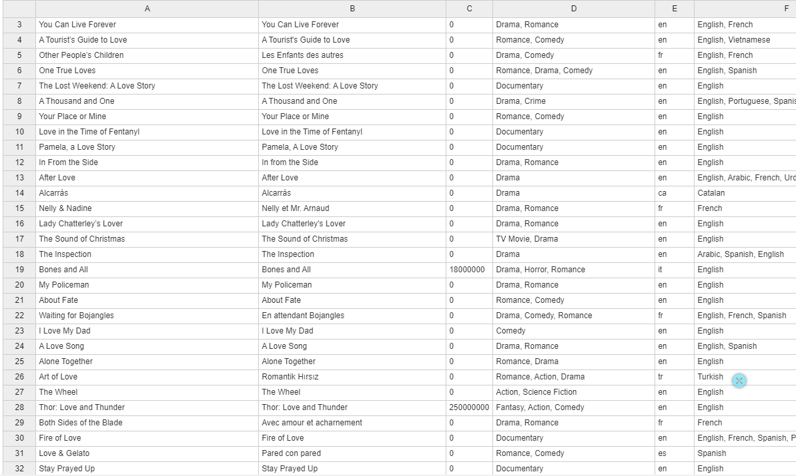

**Instructions**  
This Challenge has three parts, and must be completed in order:  

Part 1: Access the New York Times API.  

Part 2: Access The Movie Database API.  

Part 3: Merge and Clean the Data for Export.  

**Requirements**  

***Part 1: Access the New York Times API***  

query_url is correctly constructed.  
An empty list reviews_list is created.  
A for loop is created to loop through 20 times.  
The query_url is extended to include a page.  
A GET request is made to retrieve results and the JSON data is stored in a variable called reviews.  
A 12-second interval is used between queries.  
A try-except clause is used.  
Inside the try clause, there is a loop to loop through the reviews["response"]["docs"] list.  
The reviews results are correctly appended to reviews_list.  
The query page number is printed.  
The except clause prints out the page number that had no results, then breaks from the loop.  
json.dumps with the argument indent=4 is used to preview the first five results.  
reviews_list is converted to a Pandas DataFrame using json_normalize().  
The title is extracted from the "headline.main" column and is saved in a new column "title".  
The "keywords" column is correctly converted to string data using the supplied extract_keywords function.  
A list called titles is created from the "title" column using to_list().  

***Part 2: Access The Movie Database API***  

Preparation:  

An empty list called tmdb_movies_list is created.  
A variable called request_counter is created and assigned the value of 1.  
A for loop is created to loop through the titles list.  
Inside the titles for loop:  

request_counter is incremented by 1.  
time.sleep(1) when request_counter reaches a multiple of 50.  
A GET request that sends the title to The Movie Database search is performed, and the JSON results are retrieved.  
A try-except clause is used.  
The except clause prints out a statement if a movie is not found.  
Inside the try clause:  

The movie ID is collected from the first result and saved as a variable.  
A GET request is made using the movie query URL and movie ID to retrieve the full movie details in JSON format.  
The genre names are extracted from the results into a list called genres.  
The spoken_languages' English names are extracted from the results into a list called spoken_languages.  
The production_countries' names are extracted from the results into a list called production_countries.  
A dictionary is created with the specified 15 fields.  
The results dictionary is appended to the tmdb_movies_list list.  
A message is printed with the name of the movie to indicate that the title was found.  
Actions after the results are collected:  

The first five results are previewed using json.dumps with the argument indent=4.  
The results are converted to a DataFrame called tmdb_df with pd.DataFrame().  

***Part 3: Merge and Clean the Data for Export***  

The New York Times reviews and TMDB DataFrames are merged on the title column.  
A list called columns_to_fix is created to store the names of the genres, spoken_languages, and production_countries  columns.  
A list is created called characters_to_remove containing [, ], and '.  
A for loop is created to loop through columns_to_fix.  
The columns to fix are converted to the string data type.  
characters_to_remove is looped through to remove the characters from the string using the Pandas str.replace() method.  
The head of the updated DataFrame is displayed to confirm the list characters were removed (2 points).
The byline.person column is dropped.  
Duplicate rows are deleted.  
The DataFrame index is reset.  
The DataFrame is exported to a CSV file without the index.  

Output  
  